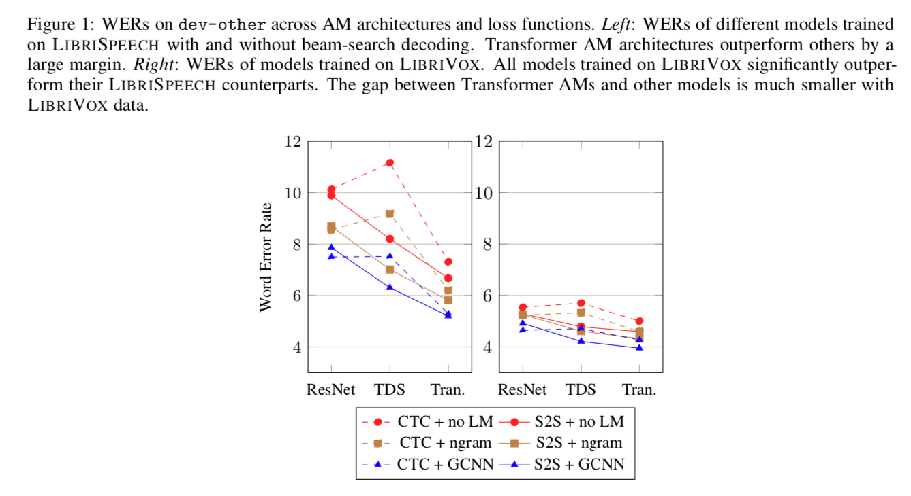
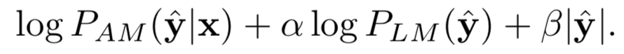
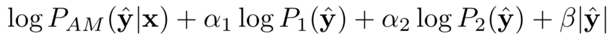
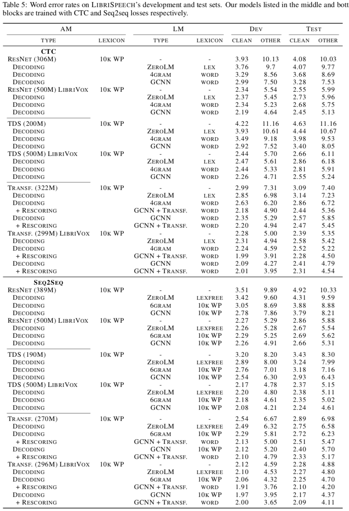

# End-to-End ASR: From Supervised to Semi-Supervised Learning with Modern Architectures
## Abstract
- Pseudo-labeling for the semi-supervised training of ResNet, TDS， Transformer for speech recognition with either CTC or Seq2Seq loss functions.
- Transformer superior alone, semi-supervision bridges the performance gap.
- A new SOTA
- the effect of different amounts of unlabeled audio

## Introduction
- E2E asr models are competitable
- Self-training can be quite effective.

## Models
### Acoustic Models
- ResNet
- TDS
- Transformer

### Language Models
- n-gram
- GCNN
- Transformer

## Dataset
- LibriSpeech for supervised training
- LibriVox for pseudo-labeling - 53.8K hours

## Decoding
- Beam-search + LM + Rescoring

## Experiments
