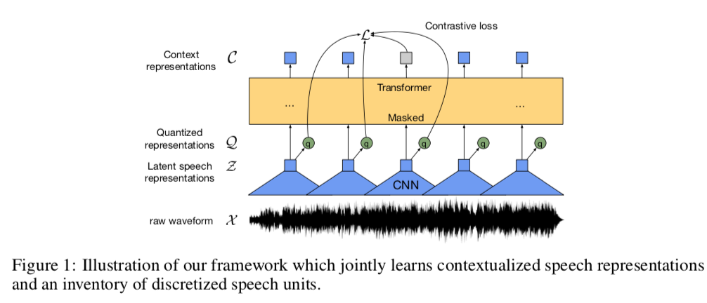
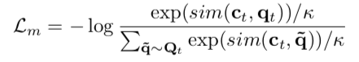
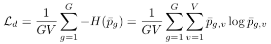
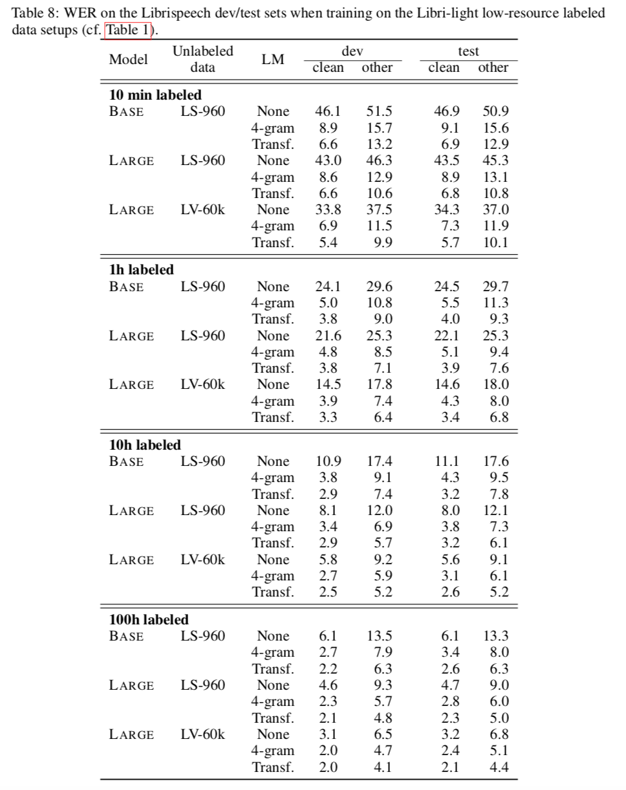
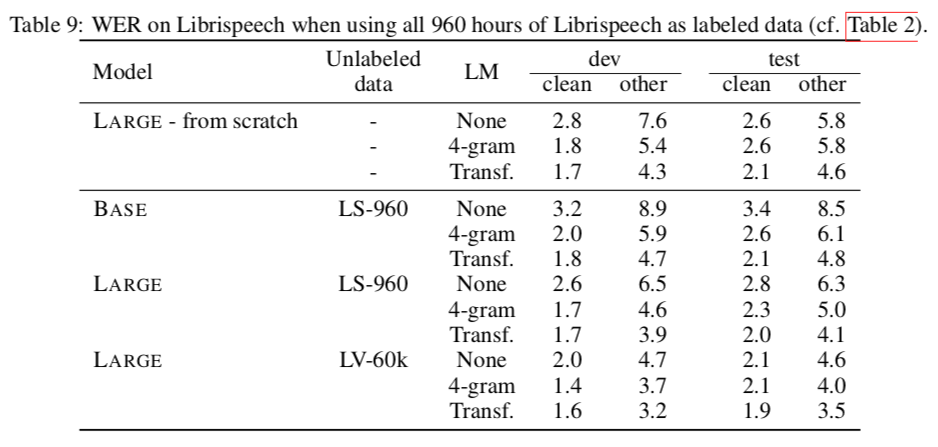

#  wav2vec 2.0: A Framework for Self-Supervised Learning of Speech Representations

## Model

Feature encoder $f: \chi \mapsto \mathcal{Z}$ 
- $\chi$: raw audio
- $\mathcal{Z}$: latent speech representations

Transformer $g: \mathcal{Z} \mapsto C$
- $C$: contextualized representations that capture information from the entire sequence

Quantization module$: Z \mapsto Q$
- $Q$: the targets in the self-supervised objective

## Training
### Masking
mask a portion of feature encoder outputs and replace them with a trained feature vector shared between all masked time steps

### Objective
$\mathcal{L} = \mathcal{L}_m + \alpha\mathcal{L}_d + \beta\mathcal{L}_f$
- 
- 
- $\mathcal{L}_f:$ L2 penalty

## Fine-tuning
Pre-trained models are fine-tuned for speech recognition by adding a ramdomly initialized linear projection on top of the context network into C classes representing the vocabulary of the task.

## Experiments

