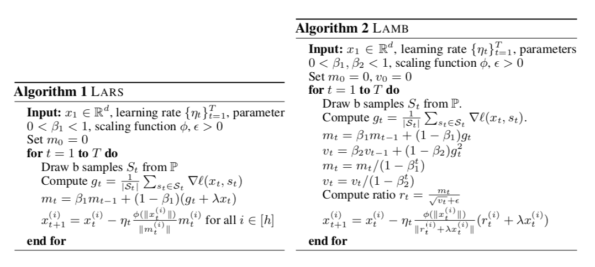
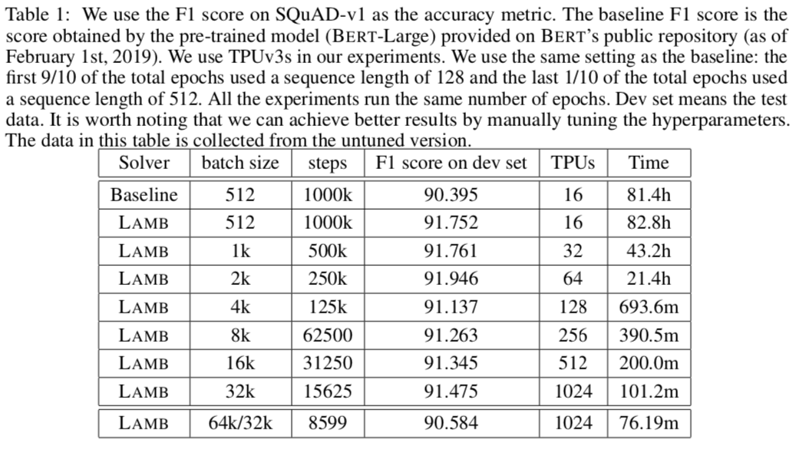
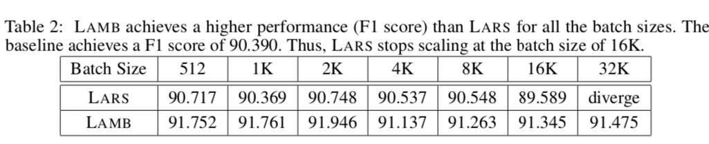

# Large Batch Optimization for Deep Learning: Training BERT in 76 Minutes
## Backgroud
Training large deep neural networks on massive datasets is computationally very challenging.
Many interests in using large batch stochastic optimizaiton methods

## Contribution
Principled layerwise adaptation strategy to accelerate training of deep neural networks using large mini-batches.
New large batch optimization technique called LAMB

## Algorithms

## Experiments

