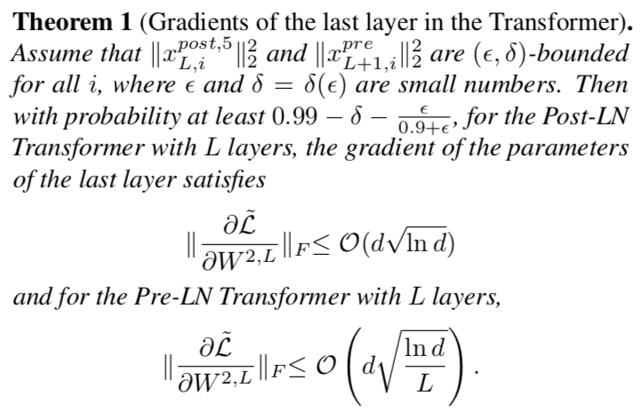

# On Layer Normalization in the Transformer Architecture

## Motivation
To explore why the learning rate warm-up stage for transformer is essential.

## Pre-LN vs Post-LN
### Visualizations

### Mathematical formulations

## Understanding the transformer at initialization

## Experimental results

## Conclusion
- In the post-ln block, the expected gradients of the parameters near the output layer are large at initialization. This leads to an unstale training when using a large learning rate.

- The pre-ln block can be trained without the warm-up stage and converges much faster.