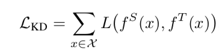
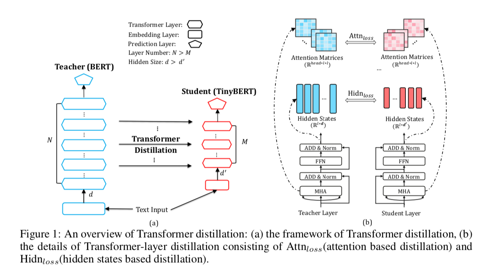
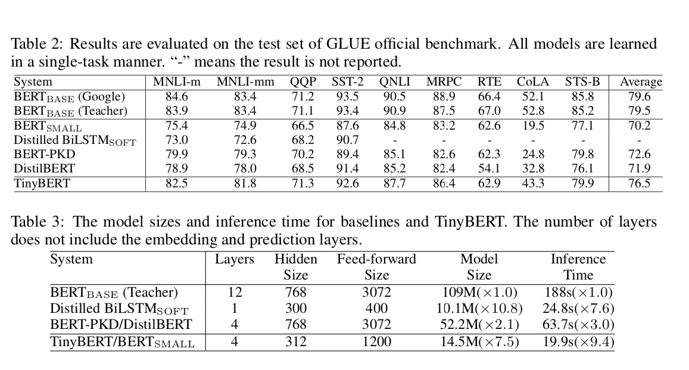

# TinyBERT: Distilling BERT for Natural Language Understanding

## Backgound
Pretrained models are computationally expensive and memory intensive. It is difficult to exectute on resource-restricted devices.

## Contribution
To accellerate inference and model size, a transformer distillation method is proposed.

## Method
### Problem Formulation
- Transfer the knowledge of a large teacher network T to a small student network S. 

### Transformer Distillation

## Experiments
