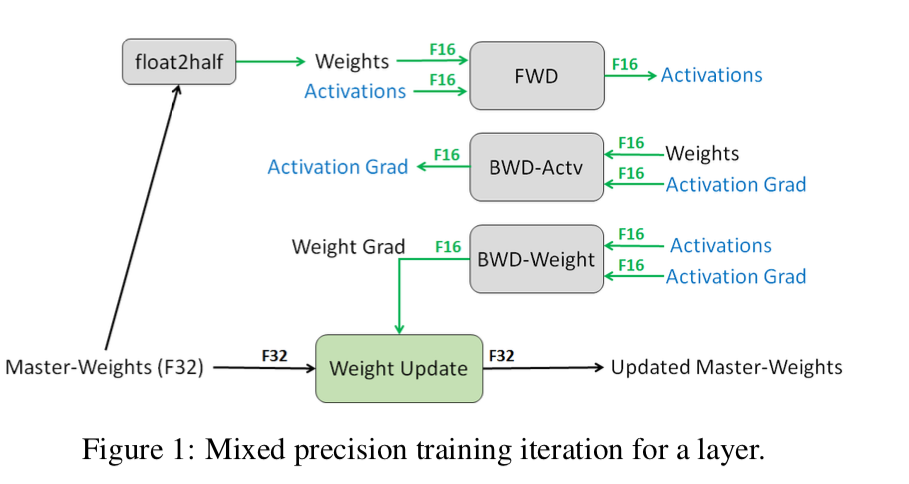
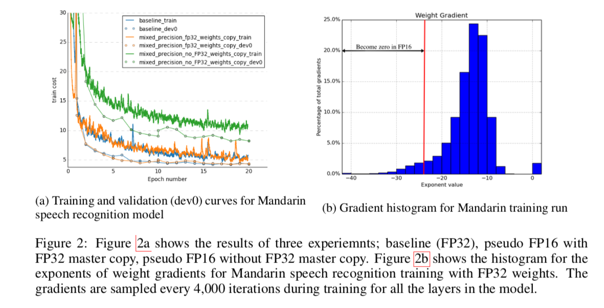
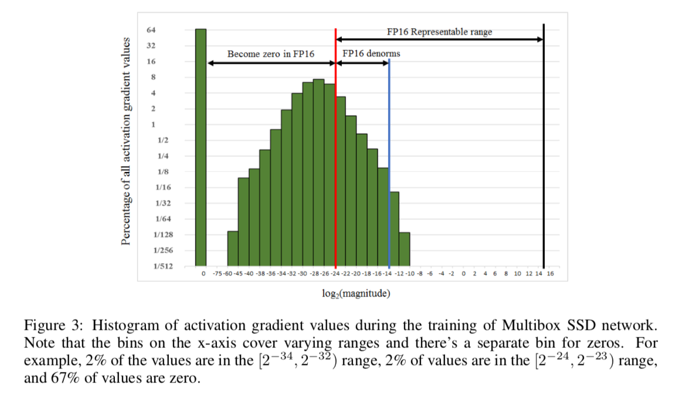
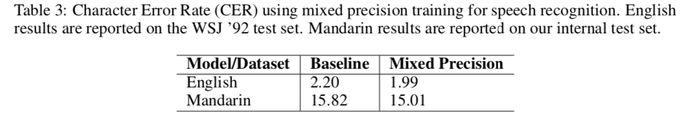

# MIXED PRECISION TRAINING

## Motivation
Larger models which can improve accuracy usually require more compute and memory resources to train. These requirements can be lowered by using reduced precision representation and arithmetic (FP32 -> FP16).

## Key Techniques
### FP32 Master Copy of Weights

#### Why do we need fp32 master?
1. Updates (g * lr) become too small to be represented in FP16
2. The ratio of the weight value to the weight update is very large

### Loss Scaling

#### How to shift the gradient values
scale the  loss! (right after the backward pass but before gradient clipping or any other gradient-related computations)
#### How to choose scaling factor
empirically

### Arithmetic Precision

## Results
