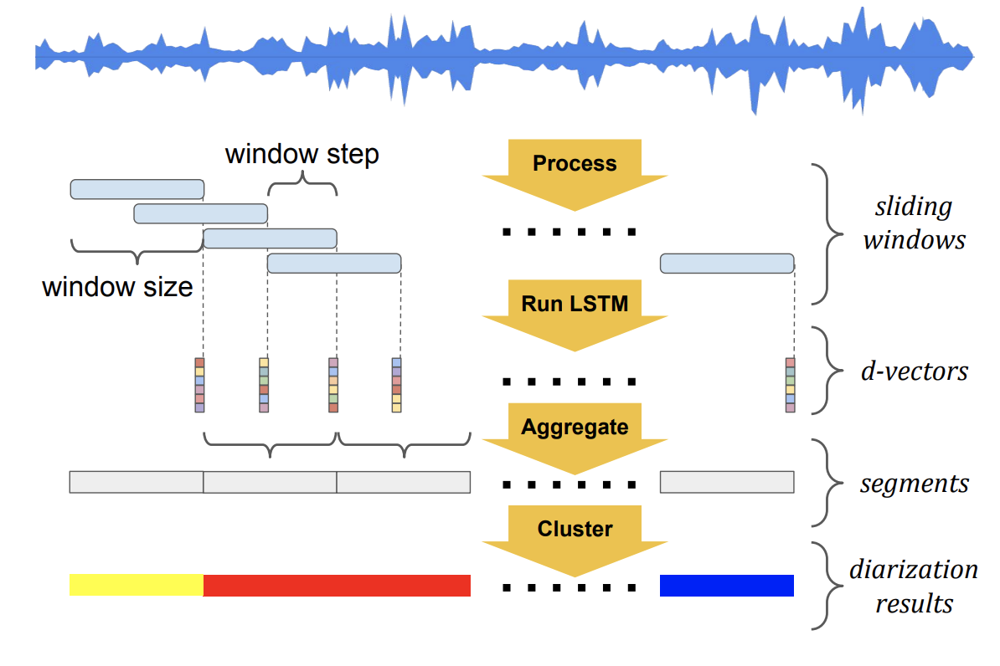
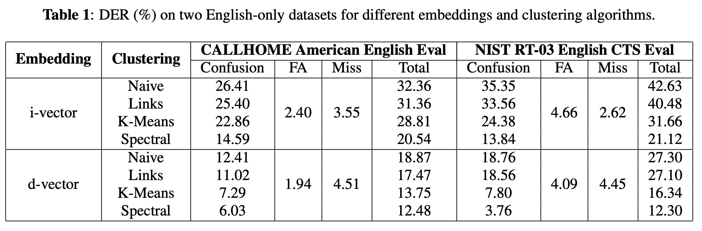

# SPEAKER DIARIZATION WITH LSTM

## Abstract
- Develop a new d-vector based approach to speaker diarization 
- 12 diarization error rate on NIST SRE 2000 CALLHOME

## Introduction
- Speaker diarization answers the question "who spoke when" in a multi-speaker environment
- The system consists of four components: 
  1. speech segmentation
  2. embedding extraction
  3. clustring
  4. resegmentation

## Diarization with d-vectors
1. log-mel-filterbank energies of dimension 40 for each frame
2. frames -> LSTM
3. VAD
4. L2 normalized and averaged

## Clustering
- Naive online clustering
- Links online clustering
- K-Means offline clustering
- Spectral offline clustering

## Experiments
