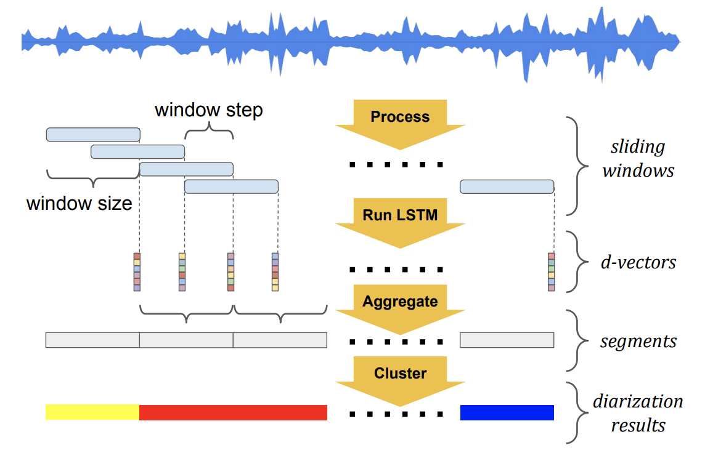
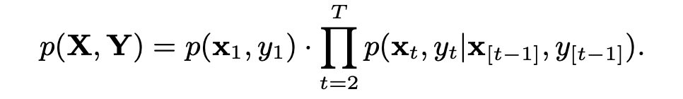
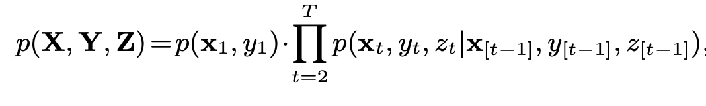
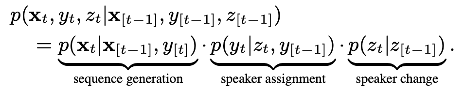
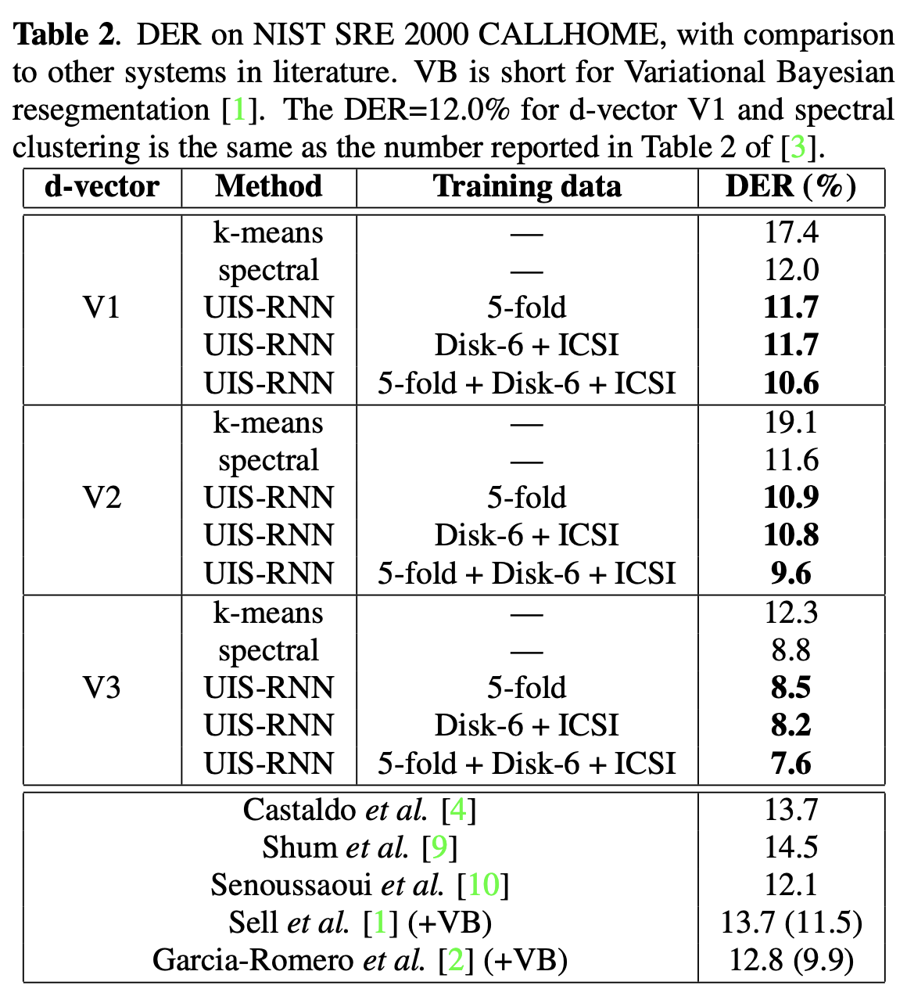

# FULLY SUPERVISED SPEAKER DIARIZATION
## abstract
- propose unbounded interleaved-state recurrent neural networks (UIS-RNN)
- 7.6% diarization error rate on NIST SRE 2000 CALLHOME
  
## BASELINE SYSTEM USING CLUSTERING

-  built on top of SPEAKER DIARIZATION WITH LSTM

## UISRNN

## Experiments
