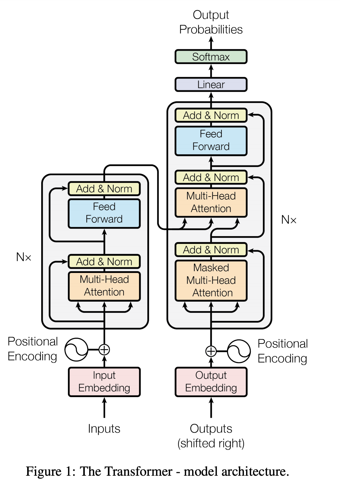
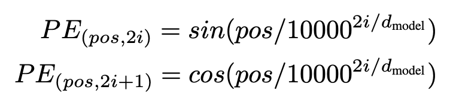
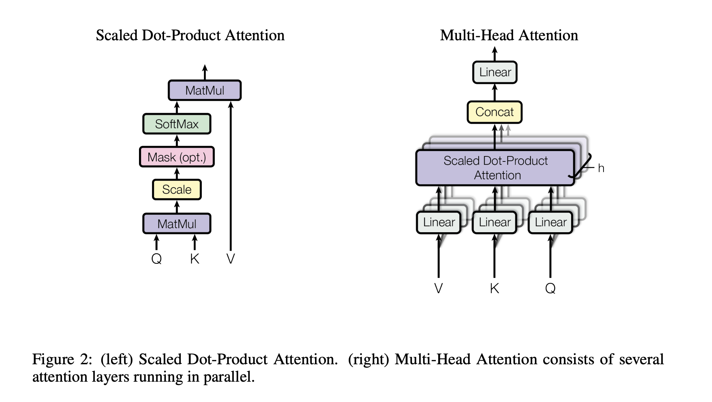
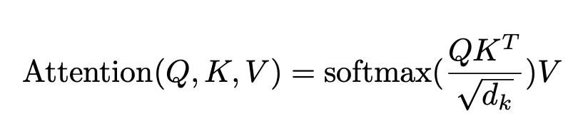
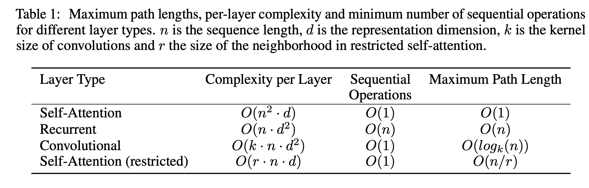

# Attention is all you need

## Abstract
- propose a new simple network architecture, the Transformer
- experiments show these models to be superior in quality while being more parallelizable and requiring significantly less time to train
- the Transformer generalizes well

## Model Architecture

- Input Embedding, Output Embeding has the same embeding layer.
- Positional Encoding
  - no convolution, no recurrence, so no use of sequence order
  
- multi-head attention 

    > the authors suspect that for large values of $d_k$, the dot products grow large in magtitude, pushing the softmax function into regions where it has extremely gradients. To counteract this effect, they scale the dot products by $\frac{1}{\sqrt{d_k}}$

    >  In "encoder-decoder attention" layers, the queries come from the previous decoder layer, and the memory keys and values come from the output of the encoder.

## Why self-attention
