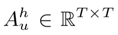
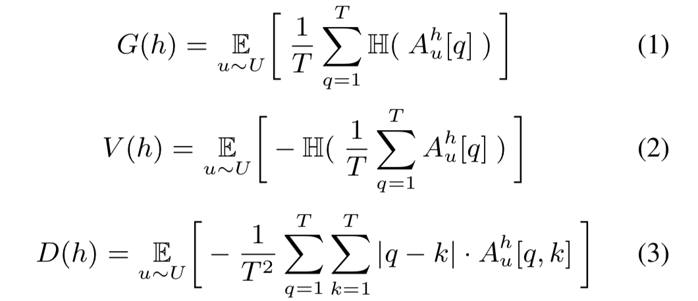

# Understanding Self-Attention of Self-Supervised Audio Transformers

## Abastract
- explore how SAT work
- categorize attentions into 3 categories
- visualization tool
- importance ranking stategies and attention refinement techniques

## SAT
Self-Supervised Audio Transformers (SATs) are BERT-based models. Unlike BERT, their inputs are acoustic features and SATs minimize reconstruction error between real frames and predicted frames.

## Visualization and Categorization
- : attention map
- three categories of attentions
  1. global: flat attention distributions
  2. vertical: attetion maps with vertical lines
  3. diagonal: attention maps with diagonal

