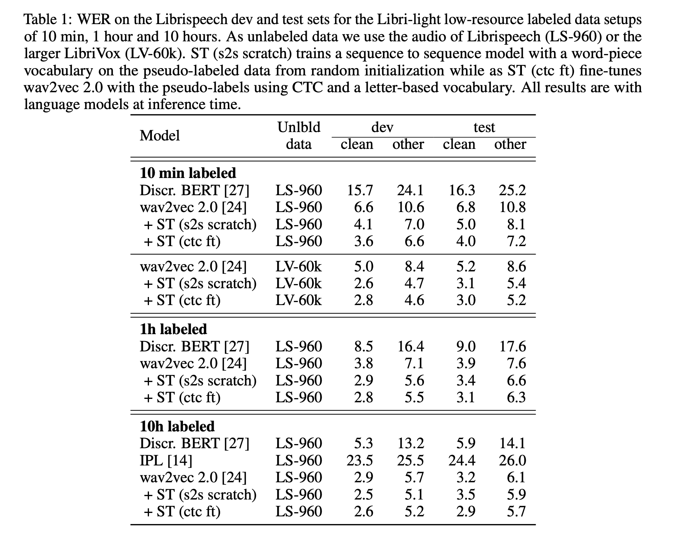
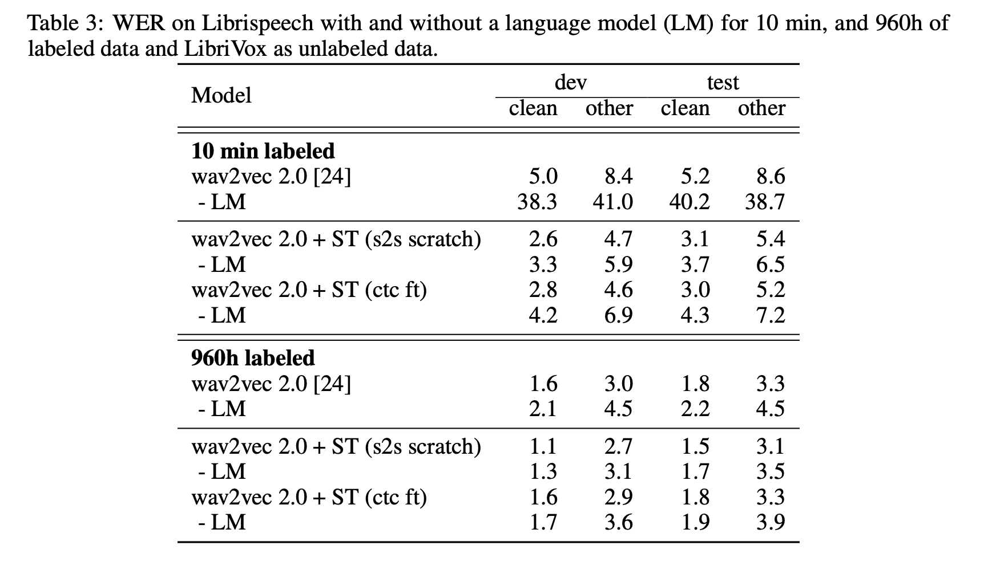

# Self-training and Pre-training are Complementary for Speech Recognition

## Abstract
Self-training and unsupervised pre-training can be effectively combined. Using just 10 minutes of labeled data from Libri-light as well as 53k hours of unlabeled data from LibriVox achieves WERs of 3.0/5.2 on the clean and other test sets of Librispeech.

## Background
### Unsupervised Pre-training Model
The wav2vec 2.0 model contains a feature encoder which maps raw audio into speech representations which are input to a Transformer to output context representations. Each feature representation represents about 25ms of audio strided by 20ms. 
During training, feature representations are discretized with a quantization module. The quantization module uses Gumbel softmax to choose entries from two codebooks with 320 entries each and the chosen entries are concatenated to obtain q.

The model is trained by solving a contrastive task over masked feature encoder outputs. At training time, spans of 10 time steps with random starting indices are masked. The objective requires identifying true quantized latent for a masked time step from 100 distractors sampled from other masked time steps. 

### Self-training Approach
This approach first train a acoustic model on the available labeled data and then labels unlabeled data with the initial model as well as a language model in a step called pseudo-labeling. Finally, a new acoustic model is trained on the pseudo-labeled data as well as the original labeled data.

## Experiments

