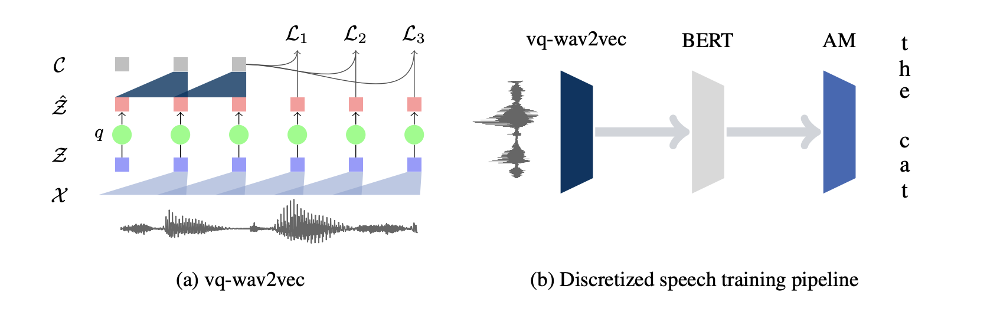
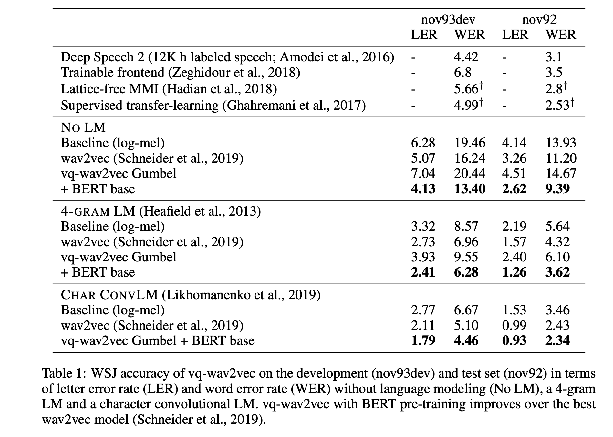

# VQ-WAV2VEC: SELF-SUPERVISED LEARNING OF DISCRETE SPEECH REPRESENTATIONS

## Abstract
- propose vq-wav2vec to learn discrete representations of audio segments through a wav2vec-style self-supervised context prediction task.

## vq-wav2vec

- BERT training is done by masking spans of consecutive
discretized speech tokens.

## experiments
