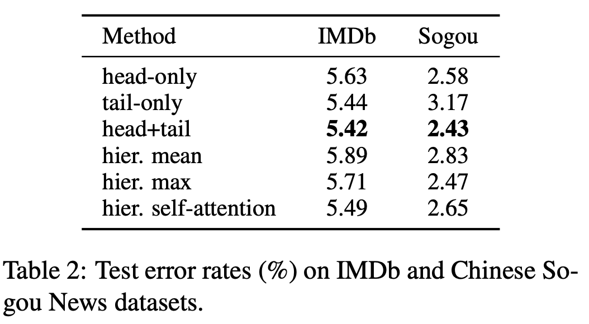
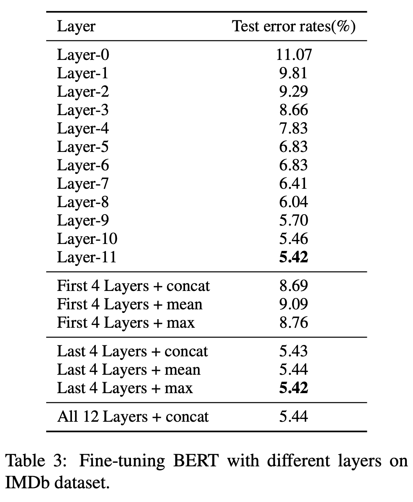

# How to Fine-Tune BERT for Text Classification?

## Abstract
- Language model pre-training is useful
- Exaustive experiments to investigate different fine-tuning methods of BERT on text classification task
- New SOTA on this task

## Introduction
- Text representation - a important intermediate step
- Word embedding and fine-tuning methods
- Contribution
    1. A general solution to fine-tune pretrained BERT model
    2. Investigation on target task

## Methodology

### Fine-Tuning Strategies
- sequence length
- layer selection
- better optimizer for overfiting problem

parameters: $\theta = \{\theta^1, ..., \theta^L$
learning rate: $\eta^l$
and: $\eta^{l-1} = \epsilon\eta^{l}$
update: $\theta_t^l = \theta_{t-1}^l - \eta^l \frac{\partial J(\theta)}{\partial \theta^l}$

### Further Pre-training
- Within-task
- In-domain
- Cross-domain

### Multi-Task Fine-Tuning
- Sharing BERT layers and embedding layer

## Experiments

